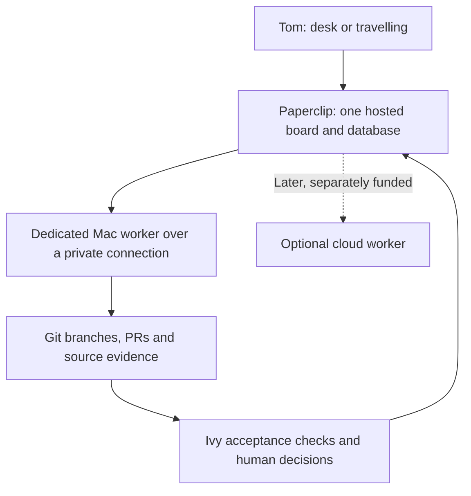

# Always-on Paperclip, Mac execution first

22 September 2026. Tom approved planning and building this direction after the
$40/month Railway compute proposal. Hosting scope: one private board and its
database, with a $30 alert and $40 compute shutdown limit before tax. This does
not authorize model APIs, cloud execution, an extra paid network service, or
production queue migration. Provision within the existing proposal once Tom
connects the hosting account; do not ask him to reapprove individual build tests.

## Product requirement: technical capability accessible to nontechnical people

Tom's explicit direction, 22 September 2026: Ivy must enable nontechnical people
to operate and ship with the impact of a capable technical operator. The supplied
Alan Chang screenshot is a useful delivery-process heuristic. Its claims about
velocity and its thirteen steps are third-party ideas, not measured Ivy results
or instructions to implement every step literally.

The user's experience starts with an outcome: who needs something, what should
change, and what constraints matter. Ivy turns that into a concrete preview,
acceptance checks and a delivery plan, carries out routine technical decisions,
and returns a working result with evidence of what it does. The user must not
need to understand agents, repositories, pull requests, harnesses, containers or
hosting plans to complete the normal journey. Technical detail remains available
when requested; unresolved risk, spend and consequential choices remain visible
in plain language.

**Clarity. Clear boundaries. Direction.** These apply to the product experience:
what is being delivered, what it can do, and what happens next.

| What the person sees | What Ivy handles underneath |
| --- | --- |
| Describe the result in ordinary language | Clarify material gaps; gather relevant context and requirements |
| Review a working preview and expected cost | Design, implementation plan, scoped permissions and acceptance checks |
| Make a meaningful business decision when needed | Routine repairs, technical review and appropriate specialist escalation |
| Receive a usable result and confirmation of what works | Tests, deployment, health checks and retained release evidence |
| See results and request a change | Outcome measurement, incident investigation and proposed improvements |

A simple interface is insufficient if users still need to orchestrate the work.
Ivy must own the path from intent through delivery and ongoing operation, within
the scope the user delegates. Show a blocker as its effect and next action, with
a recommendation; do not forward an infrastructure error as the user's problem.
Ask for necessary connections once through the provider's secure flow. Never ask
for secrets in chat or pretend an unavailable connection is working.

Use review effort proportionate to the possible harm, reversibility and strength
of the evidence. A track record may inform review but cannot by itself establish
that a new change is safe. Relevant regulatory requirements require reliable
sources and specialist review where needed. Incident learning should identify
contributing causes and missing controls; naming a person or agent is not a
substitute for establishing causality. Record proposed lessons, test them, and
validate behavior changes before promoting them to operational agents.

Paperclip is initially the internal coordination layer and operator console.
Its technical board is not yet the intended nontechnical Ivy experience. The
current deployment remains a foundation milestone; it does not demonstrate this
product requirement. Do not broaden the ongoing release into a complete new
interface before selecting and proving one end-to-end use case.

### Ivy as the default place to delegate work

Tom extended the direction on 25 September: Ivy should become the default system
for running work across his projects. The [role and routing design](model-routing-review-20260923.md)
separates an interactive coordinator, investigation, implementation, adversarial
review, narrow repairs and premium escalation. These are responsibilities within
one task; simple work should not pass through a mandatory team of agents.

The person describes the result, provides relevant context and delegates a scope.
Ivy keeps that context and approval history, chooses an eligible execution profile,
verifies the result and follows through on operation. The coordinator remains
responsive while difficult work proceeds. Model, effort, permissions and budget
are separate controls, and changing one never silently widens the others.

For example, an enquiry-page task can need investigation of requirements, a short
brief, implementation, a review of data handling and an observed test delivery.
The person should make the business choices about the enquiry and destination;
Ivy handles ordinary implementation and repairs within that authority. An existing
clear brief can skip investigation. A typo can take a direct edit-and-check path.

This applies the same task and evidence model to future research, documents and
connected operations. Each workflow still needs its own qualified tools, access
and outcome checks before unattended use. The existing engineering acceptance
proof is a supporting capability; it does not by itself establish a working
general-purpose assistant or a validated broader customer market.

### First journey and acceptance cases — proposed, not yet run

Candidate journey: a small-business operator asks for an enquiry page that
collects the information they need and routes enquiries to their chosen existing
inbox. The person reviews the actual page and a test enquiry, sets a budget and
approves publication. Success includes verified delivery of the enquiry and an
observable business result; generating code alone does not complete the job.
Use only fictional data during validation and publish only within authorized
scope. Confirm this journey with intended users before treating it as validated.

1. A nontechnical participant can move from the ordinary-language brief to a
   usable result without explaining a stack or interpreting a technical error.
2. The participant can state what will be published, who can access submitted
   information, expected cost and how to request a change or stop the service.
3. A routine recoverable failure is resolved inside scope without repeated
   implementation approvals; a material business choice gets a concrete preview,
   a recommendation and the consequence of each option.
4. A missing permission, unreachable worker or failed check produces a clear
   status and next action. It never produces a false completion claim.
5. An independent check observes the page, submission and expected destination
   before delivery is described as working. Public release and later health are
   verified separately.
6. A human correction or production issue produces a traceable proposed
   improvement and an explicit regression case before operational behavior changes.

Record completion, user interventions, time, cost, outcome evidence and recovery
failures for the same journey. No user study, end-to-end product pass or model
quality claim exists yet. After the Paperclip release, evaluate Jev against this
journey and its integration/operating cost; the specific Jev product still needs
identification.

## Architecture



Paperclip owns task state and, after a controlled cutover, dispatch for the
selected task class. A Mac worker executes jobs; it is not a second Paperclip
server or a second business queue. Existing production Ivy dispatch continues
unchanged until that cutover. Never assign the same task to both dispatchers.

Use Paperclip's native **SSH environment driver** for the first connection.
The pinned 2026.916.1 release already supports remote workspaces, host-key
verification and a stored private-key secret reference. These controls are
experimental. Reuse them and prove the actual Mac behavior before adding custom
transport or automatic fallback.

## Implementation stages

| Stage | Deliverable | Evidence needed to advance |
| --- | --- | --- |
| 1. Private board | Guarded pinned image, persistent app/database storage, one owner, signup locked, backups | Local real-image auth/restart/restore checks, then provider HTTPS and billing checks |
| 2. Mac connection | Dedicated OS account, private network route, scoped SSH identity, isolated workspaces | Exact host identity, workspace ownership, harmless remote process and reconnect/stop tests |
| 3. One real task class | Explicitly assigned Mac agent, versioned contract, independent acceptance | Complete one representative task; retain failure/disconnect evidence; stop old dispatcher for that class |
| Later, optional | Cloud worker for periods without a reachable Mac | Separate cost/auth approval, compatible harness, no duplicate execution during handoff |

Stage 1 now has executable startup checks and a real local rehearsal. Stage 2
has a tested configuration renderer; the Mac is **not connected**. No new SSH
service, Mac account, network tunnel or persistent worker has been installed.

## Mac connection contract

- A dedicated Mac account owns its own workspaces. Never give the hosted board
  Tom's normal SSH key or access to `/Users/tom/Build/ivy`, his home or existing
  provider authentication. A workspace path is not itself an OS sandbox.
- Reach that account through a private route, for example a Tailscale network.
  Railway-to-Mac connectivity and any network service plan must be verified;
  there is no assumption that the prepared Railway container can already reach
  a tailnet address. Do not expose the Mac's SSH port on the public internet.
- Generate a new SSH identity for this connection. Keep its private key in
  Paperclip's encrypted secret store, use a pinned secret version, and verify
  the Mac's ed25519 host-key fingerprint through an independent local channel.
- The account's authorized key must disable forwarding and agent forwarding;
  account permissions limit its filesystem access. Enforce connection limits
  through private-network policy. This access setup precedes connection testing.
- Model authentication is established separately for the dedicated worker.
  Do not copy Tom's existing subscription login. The first connection test runs
  a harmless fixed command with no model/provider credentials.

The renderer uses the exact released environment fields and reads only the
explicit public host-key file supplied by the operator:

```sh
python3 -B -m ivy_acceptance.paperclip_mac \
  --host WORKER.TAILNET.ts.net \
  --username ivyworker \
  --workspace /Users/ivyworker/workspaces \
  --secret-id UUID_FROM_PAPERCLIP_SECRET_STORE \
  --secret-version 1 \
  --known-hosts-file /absolute/path/to/verified-worker-known-hosts \
  --output /absolute/new/mac-environment.json
```

Replace the uppercase placeholders; use a lowercase actual host. Output creation
is exclusive. It is a prepared environment payload, not an API call or proof of
reachability. The renderer rejects public/loopback destinations, Tom/root accounts,
workspace paths outside the dedicated account, wildcard or malformed host pins,
raw private keys, and unpinned secret versions. It cannot verify account ownership
or resolve a hostname without the later live connection check.

## Disconnect and travel behavior

- Mac reachable: explicitly assigned new jobs can run on it after validation.
- Mac unavailable before dispatch: leave work queued or blocked and show the
  reason. Do not silently run it on the board container or buy cloud capacity.
- Connection lost during work: treat execution as uncertain. Do not equate an
  SSH client exit or an expired heartbeat with remote process termination.
- Before retry: reconnect, inspect the recorded process/workspace and resulting
  artifacts, establish whether it completed or stopped, then permit a new run.
  Stop uncertain agents to prevent recovery loops while that is unresolved.
- Travelling with a Mac left awake: the same worker can remain available after
  the private route is verified. With the Mac asleep, the board remains usable
  for planning and review while execution waits.

These are rollout requirements, not a claim that automatic availability routing
or remote shutdown is already implemented. Native behavior must be tested with
an explicit interrupted-run case before unattended use. Cloud fallback remains
off in this first implementation.

## Cost and operations

Hosting the board has a continuous baseline regardless of where the worker runs.
Local execution avoids adding cloud build/worker load to that baseline. Record
actual RAM/CPU/storage measurements after deployment and compare projected
monthly usage against the $30 alert. A brief idle-container sample is not a
monthly bill forecast. The $40 hard limit sacrifices availability at exhaustion.

Current status and all failures live in [the existing handoff](runtime-handoff.md).
Source references: [Paperclip environments](https://docs.paperclip.ing/experimental/environments/),
[pinned SSH transport](https://github.com/paperclipai/paperclip/blob/d554c4789ed3930f8a53ac9fdf6503b3187097da/packages/adapter-utils/src/ssh.ts),
[pinned config schema](https://github.com/paperclipai/paperclip/blob/d554c4789ed3930f8a53ac9fdf6503b3187097da/server/src/services/environment-config.ts).
