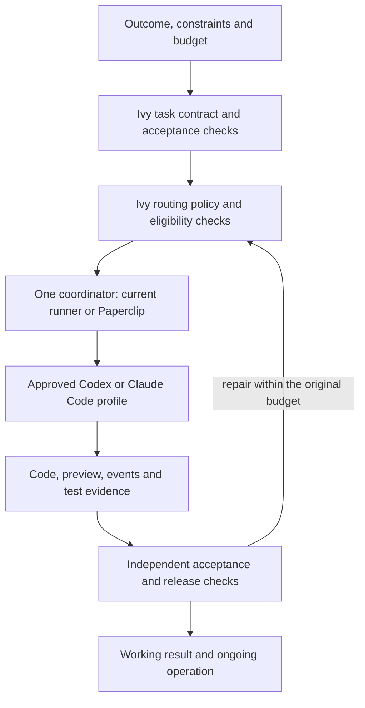

# Ivy harness and routing reassessment — 23 September 2026

Decision proposal, not a production routing change. Tom asked how Opus 5.5,
GPT-6 Sol and GPT-6 Luna should change Ivy's harness, smallest useful patch and
system design. “PaperPip” is interpreted as Paperclip and “Luda” as Luna.
No evaluated model, judge, Docker worker or paid API request was launched.

## Recommendation

Keep Ivy's task contract, routing policy and acceptance rules independent of
Paperclip. Use one coordinator for each task class, native coding harnesses for
execution, and separate verification before publication. Begin with Sol as the
implementation candidate, Luna for bounded support work and Opus for difficult
planning/debugging and selected independent reviews. These are hypotheses based
on documented positioning, not a demonstrated quality ranking on Ivy tasks.

A nontechnical user describes the outcome, reviews a preview and makes material
business decisions. They do not select models, reasoning effort or agent teams.
Ivy selects an eligible execution profile within the user's scope, deadline and
budget. A stronger model never automatically gets broader permissions.

## What the current code actually does

Read-only inspection: main checkout `1581b2f54ef9c197ed317ea8112c1c3e4d8e8df7`;
runner clone `f049a892d4bf3585952615cda56b99be5d46f1de`. The runner script's bytes
match between these checkouts; the configurations differ overall, but inspected
lane mappings agree. No checkout was synchronized or modified by this review.

- `config.yml`: Anthropic frontier/workhorse both select `claude-opus-5`, with
  configured efforts xhigh/medium. OpenAI maps to `gpt-5.6-sol`/`gpt-5.6-terra`;
  the fast-cheap lane has Haiku only.
- `scripts/dispatch-runner.py:harness_argv` reads harness and model but never
  passes effort. A direct pure-function check produces identical Claude command
  arrays for frontier and workhorse. Neither command pins effective effort.
  This is a confirmed launcher defect, not a model-quality finding.
- Current capture records requested model, harness name, wall time and exit;
  it does not establish effective effort, harness version or all loaded context.
  The acceptance scaffold already models requested runtime/instruction identity;
  reuse it rather than inventing a second evidence scheme.
- A zero exit plus report delimiters enters `done` pending external verification.
  Preserve the distinction between a completed attempt and an accepted outcome,
  and make it explicit in any replacement coordinator.
- `memory/models.md` contains fifteen historically verified records dominated
  by reviews, plus separate failure commentary. Broad lane labels, non-paired
  tasks, mixed verification strength and selection of successful records cannot
  establish a comparative model win or a new model's reliability.
- Local help inspected: Codex CLI 0.155.1 and Claude Code 2.1.277. Claude exposes
  `--effort`; Codex exposes config overrides and structured JSON events. Help
  confirms interface shape, not access to the proposed model or effective run
  settings. No auth files were opened. Codex help emitted a sandbox PATH-alias
  warning; no agent session was started.

## Candidate routes

| Work | Initial candidate | Qualification / escalation |
| --- | --- | --- |
| Exact checks, budgets, file hashes, CI state | Ordinary code | No model needed for a deterministic decision |
| Extract fields, categorize known requests, summarize verified progress | Luna low/medium | Schema and source checks; ambiguous or consequential decisions go to a stronger route |
| Bounded bug fix, ordinary feature, tests | Sol medium | High effort for demonstrably difficult reasoning; inspect failure cause before escalating |
| Ambiguous product/design problem, difficult debugging | Opus medium/high, compared with Sol high | Test on the same cases; do not assume Opus is always better |
| Material auth/data/security change | Capable builder plus independent review | Route directly; do not first burn a cheap attempt. Human decision for material unresolved risk |
| Routine code review | Sol or Opus in a fresh reviewer context | Prefer another provider for selected critical cases, not mandatory double review of everything |

Keep existing lane names compatible while introducing explicit task/risk profiles.
Provider-specific effort levels are not interchangeable quality units. Separate
complexity from consequence: a one-line access-control change may deserve more
review than a large cosmetic edit. Model self-confidence cannot lower risk.

## System design

Keep the first router a small deterministic module and versioned configuration,
not another always-running reasoning agent or a new microservice. Decide using
task class, ambiguity, risk, required tools, permitted data destinations, runtime
availability, quota and budget. The coordinator manages queue ownership and run
lifecycle; the harness manages tool use and model sessions; Ivy owns acceptance.
Paperclip already has Codex/Claude adapters. Its current docs do not prove new
model support in our pinned 2026.916.1 installation: validate that exact adapter
and CLI combination before promoting a route.

On a handoff, pass a versioned task, pinned commit/artifact references, test
results, known blockers and remaining budget. Start a fresh provider session;
do not splice private reasoning or incompatible session tokens across models.
Keep task input/tool policy stable within a continuing provider session.

Retries retain one task budget and all attempts. A missing credential, broken
network or uncertain remote shutdown is an environment/lifecycle problem, not
an instruction to buy a different model. Before a second worker starts, reconcile
ownership and confirm the prior attempt cannot continue. Infrastructure backoff
and reasoning escalation are separate mechanisms. Never silently fall back from
subscription execution to paid API execution.

## Smallest useful patch and rollout

1. **Make configuration effective.** Add provider-specific effort translation and
   validation, explicit supported model IDs and an inspect-only route preview.
   Test full config-to-command resolution. Reject unsupported combinations before
   claiming a task. Do not assume fixing ignored effort is behavior-neutral: it
   can increase consumption and change output even with the same model ID.
2. **Capture what ran.** Record requested settings, effective settings when the
   harness exposes them, CLI/adapter version, policy/context/tool manifest,
   source commit, attempts and usage. Mark unavailable fields unknown. Preserve
   raw structured events privately and publish sanitized evidence. Never log
   secrets or present an API estimate as a subscription bill.
3. **Register disabled candidate profiles.** Sol, Luna and Opus profiles can be
   reviewed without changing the active dispatcher. Keep an explicit rollback
   profile. Use current native CLIs first; a custom API agent loop adds migration
   and authentication work without yet demonstrating a product benefit.
4. **Run a bounded comparison, then promote one task class.** Confirm isolated
   auth/model availability first. Replay representative tasks with common inputs,
   acceptance criteria and total budgets, then verify a fresh task. Change active
   routing only after reviewing the evidence. No live comparison is authorized
   by this document, and prior exhausted acceptance grants remain exhausted.

This can be prepared independently of the Paperclip deployment. Adding a second
scheduler, automatic cloud fallback, a learned router or a full agent hierarchy
is outside the first patch. The production checkout and dispatch remain untouched.

## Evaluation contract — proposed, not executed

Use the shared inventory at `~/Build/ivy/evals/` when implementing the routing
patch, respecting its current untracked content. Define cases for narrow repair,
ordinary build, ambiguous requirements, security review with seeded defects and
clean controls, long-context work, and failed/disconnected execution. Assess
Luna on eligible support tasks; compare Sol and Opus directly for builds/reviews.
Freeze common context and equivalent permitted tools; record unavoidable native
harness differences. That comparison measures the full model+harness profile,
not the isolated model weights. Repeat stochastic cases and retain all failures.

Measure accepted outcomes, escaped defects, review precision/recall, human
interventions, repair count, total elapsed time and usage per accepted result.
Seeded controls can establish whether defects were found; citation validity
alone cannot. Use held-out cases and human calibration, not another model's
agreement as ground truth. Publish the sample size and uncertainty. A small
campaign qualifies a canary; it does not establish universal reliability.

Deterministic patch cases: effort actually applied; unknown model/effort rejected;
critical risk cannot select the cheap route; provider pins honored; unavailable
Mac/auth blocks execution; no subscription-to-API fallback; retry budget not
reset; unknown shutdown prevents duplicate dispatch; worker claims never set
accepted; effective metadata missing stays unknown. Existing 121 software tests
are historical evidence and were not rerun for this documentation-only review.

## Costs and compatibility

Standard API prices checked 2026-09-23, USD per million tokens, uncached short
context: Luna $0.10 input/$0.50 output; Sol $2/$10; Opus $4/$20. A hypothetical
40,000 input + 5,000 output-token request costs $0.0065/$0.13/$0.26 respectively,
before tools, cache writes, long-context/region premiums and additional requests.
This is arithmetic, not a task-cost forecast. Reasoning and repeated tool turns
change total consumption; compare cost per accepted result. Subscription routes
instead need measured quota pressure, latency and availability. Railway hosting
and the previously approved $40 compute cap do not fund model API calls.

Opus 5.5 Messages API always uses adaptive thinking, rejects forced tool choice,
and constrains thinking-block reuse. Its computer-use interface also changed on
Claude API/Google Cloud. Native Claude Code manages parts of this itself; those
API breaking changes are not proof our CLI adapter fails. Validate CLI parsing,
progress and final output rather than applying API flags to a CLI command.
Sol/Luna support explicit reasoning effort; Responses is the appropriate OpenAI
API path for built-in tools if API integration is later chosen. Account access
and subscription availability have not been validated in this assessment.

Sources (official, accessed 2026-09-23):
- [Sol model](https://developers.openai.com/api/docs/models/gpt-6-sol)
- [Luna model](https://developers.openai.com/api/docs/models/gpt-6-luna)
- [OpenAI pricing](https://developers.openai.com/api/docs/pricing)
- [Opus 5.5 overview](https://platform.claude.com/docs/en/models/opus-5-5/overview)
- [Opus migration](https://platform.claude.com/docs/en/models/opus-5-5/migration-guide)
- [Paperclip adapters](https://docs.paperclip.ing/reference/adapters/overview/)

## Decision

Ship the harness/config correctness and evidence patch first, with new routing
profiles disabled. Evaluate candidate roles, then enable one proven task class.
Keep Paperclip's hosting work separate. Milestone A, isolated real-agent auth,
new-model quality and unattended remote lifecycle guarantees remain unverified.
