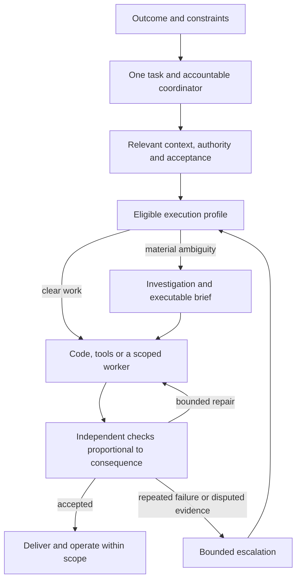

# Ivy operating roles, effort and model routing

Updated 25 September 2026; replaces this document's 23 September routing proposal.
Tom asked us to use the supplied reasoning-effort and model-lineup commentary to
improve Ivy as the default system for delegated work. The commentary is a source
of hypotheses, not an instruction to activate its lineup or evidence of Ivy's
results. This update changes design and proposed evaluation cases only.

## The product decision

Ivy should be the place a person brings an outcome and retains continuity from
request through delivery and operation. It owns the task, relevant context,
permissions, budget, acceptance evidence and follow-through while selecting an
appropriate execution profile for each stage. Model choice becomes an internal
implementation decision, visible when useful to explain quality, time or cost.

Start with existing OpenAI and Anthropic harnesses. A larger provider roster is
not a prerequisite for a broader product. Qualify each workflow and connector
before offering unattended execution. The current implementation is strongest in
repository work; research, documents and business operations are proposed future
workflows, not deployed capabilities established by this plan.

The target is accepted useful work per unit of time, consumption and human
attention. Commit count, number of agents, token volume and model agreement are
not substitutes for that result. The contribution graph remains an observation
of real work rather than the routing objective.

## What to take from the effort explanation

The useful intuition is that higher effort gives the model more room to work;
it does not require equally long deliberation on every input. OpenAI documents
adaptive reasoning at different effort levels. Supported values and defaults are
model-specific. [OpenAI reasoning](https://developers.openai.com/api/docs/guides/reasoning).

However, "ceiling" is a metaphor, not an enforceable budget. Anthropic explicitly
describes effort as a behavioral signal, and it can affect response and tool-call
tokens as well as thinking. Opus 5.5 uses adaptive thinking at every effort level;
`max` is not a universal switch that first enables thinking.
[Claude effort](https://platform.claude.com/docs/en/build-with-claude/effort).

The supplied explanation of post-training token penalties is not established by
these documentation sources. Ivy must not depend on that proposed mechanism.
Use externally enforced task/time/spend limits where available, and record gaps
in enforcement; effort alone cannot enforce any of them.

Use medium as the initial setting for well-defined work. For ambiguous work,
select a capable profile and compare high with xhigh rather than assuming xhigh
wins. Anthropic recommends calibrating Opus 5.5 from medium and measuring the
benefit of xhigh/max. [Opus calibration](https://platform.claude.com/docs/en/build-with-claude/prompt-engineering/prompting-claude-opus-5-5).
Do not transfer a level's observed behavior across model generations or providers.

## Candidate roles and profiles

These are initial candidates for evaluation, not active assignments or measured
winners. A role is a responsibility or stage, not a requirement to launch another
agent. A small clear task may complete in one session plus ordinary checks.

| Responsibility | Initial candidate | Effort and handoff |
| --- | --- | --- |
| Interactive coordinator: understand intent, maintain the task, explain progress | Opus 5.5; compare Sol 6 as the eligible alternative | Medium; retain ownership while difficult investigation runs separately when justified |
| Planner / investigator: resolve uncertainty and produce an executable brief | Opus 5.5; compare Sol 6 on the same difficult cases | Compare medium/high; qualify xhigh for difficult classes rather than enabling it for every unclear request |
| Implementer: deliver against a clear brief | GPT-6 Sol; Opus 5.5 as a qualified alternative | Medium; return to planning if material assumptions break |
| Adversarial reviewer: try to falsify correctness claims | GPT-6 Sol in a fresh review context | High initially; compare xhigh for difficult or consequential reviews; findings need evidence |
| Exact, low-consequence repair or extraction | Ordinary code first; GPT-6 Luna when judgment is still needed | Low/medium; narrow permitted actions and explicit checks |
| Premium escalation: resolve repeated failure, conflicting evidence or architectural uncertainty | GPT-6 Astra | High/xhigh candidate; one bounded diagnostic decision, then return routine work to its owner |

OpenAI's current guidance positions Luna for scoped work, Sol for everyday work
requiring judgment, and Astra for demanding work. It also recommends comparing
settings on common inputs. This supports the candidate categories, not a claim
that Sol is the best reviewer or that any model is Ivy's measured optimum.
[OpenAI model selection](https://developers.openai.com/api/docs/guides/model-selection).

Fable 5.1, Grok 4.7, Muse Spark 1.3 and DeepSeek V4 Flash remain candidates mentioned
in the supplied commentary. They are outside the initial qualification set; Ivy
has not established their access, harness support, data eligibility or comparative
results. Opus spanning several roles is a reason to test a simpler deployment,
not evidence that one subscription is universally sufficient.

## Route on the task, then select a model

Keep five decisions distinct: task stage, ambiguity, consequence, execution
profile, and authority. The execution profile binds provider/model/version,
native harness and version, effort, permitted tools/data destinations and runtime.
A model promotion never adds permissions or enlarges a budget.

A deterministic policy first filters profiles by required tools, approved data
handling, credentials, availability, remaining budget and the task's acceptance
requirements. It then selects among qualified profiles for that class. The
coordinator may propose a task classification with evidence; it cannot lower a
recorded risk or override a hard eligibility constraint by expressing confidence.

A one-line access-control change gets substantive review despite its small size.
A large mechanical rename may use code and a cheap check if its boundaries are
clear. Missing facts call for retrieval or one material question. A missing
credential calls for connection recovery. Neither is cured by more reasoning.

For a handoff, retain the outcome, sourced inputs, relevant prior decisions,
artifact/source revision, allowed actions, acceptance checks, unresolved questions
and remaining task budget. Use the smallest representation that makes the work
executable; do not demand a planning document for an obvious reversible edit.
Separate observed facts, user preferences, decisions and untrusted source content.
Share only context the receiving profile is allowed to see, rather than copying
all accounts or a provider's private reasoning between sessions.

The same task continues across stages. Reuse an eligible session when continuity
helps; use a fresh reviewer context for independence. Introduce another worker
only for a concrete bounded job whose benefit exceeds handoff/coordination cost.
The coordinator remains accountable for progress and result, including tasks
that contain research, a document and a software change.

## Stop escalation from becoming another loop

Initial limits to test, subordinate to the user's existing task budget:

1. Repair a reproducible defect within scope. Do not escalate on an exit code
   alone; classify the failure as missing context, environment, implementation,
   disputed evidence or unresolved design.
2. Two repairs that fail the same acceptance criterion without new evidence,
   repeating reviewer disagreement, or expansion beyond the agreed scope trigger
   a pause in edits and one bounded diagnostic escalation. High-consequence
   ambiguity can route directly to a capable investigator without cheap retries.
3. Give that escalation a concrete question, competing claims, reproduction and
   remaining budget. Its output is a decision, narrowed experiment or material
   question for the user, not an open-ended rewrite. It cannot approve its own
   resulting implementation by consensus.
4. If the issue remains unresolved, retain the artifact and explain the specific
   evidence or decision needed. Do not launch an indefinite sequence of reviewers.

Quota exhaustion is a separate transition. An alternative must already be
qualified for the task and approved for its data, tools and spending. Otherwise
queue the task and explain the delay. Subscription exhaustion never silently
becomes paid API use. Reconcile the previous run before starting another worker;
an unreachable machine or timed-out client is not proof of remote shutdown.

For a routine reversible action inside scope, Ivy proceeds without asking again.
For an irreversible action or new authority/spend, it prepares the concrete result
and asks for the remaining decision. It carries existing approvals forward within
their scope. Yesterday's override for PRs #22/#23 does not authorize future bypasses.

## One workflow, with direct paths for simple work

Ivy owns the contract and acceptance policy. One coordinator owns dispatch for
that task class; Paperclip is the proposed private coordination foundation, not a
second concurrent dispatcher. Native harnesses own model sessions and tool use.
A successful provider response is only an attempt result. Checks must establish
the actual promised outcome: code behavior, supported research claims, a correct
document, or the intended effect in a connected application.

A status card should show what is being delivered, what is working, what is
blocked, the next action and any decision required from the person. Model labels
and token counters are secondary details. Slow investigation should not make the
interactive coordinator appear abandoned; it should report progress and accept
corrections without losing work or changing the agreed outcome silently.

## Current evidence and the next build

Read-only snapshot on 25 September: `origin/main` at `d85d1ae`. PRs #22/#23 are
merged; native effort translation, compatibility validation, route preview and
requested execution provenance exist. Active lanes still use Opus 5 and GPT-5.6
Sol/Terra, with Haiku for fast-cheap work. Opus 5.5 and GPT-6 profiles are not live.

The shared scanner snapshot is fresh at 15:45:03 UTC with 28 checkouts. A real
25 September dispatch record now contains requested settings and runner/config/
prompt hashes, but still marks effective settings unknown and usage unavailable.
This proves the metadata path ran; it does not prove review quality or compare
models. The reports on #22/#23 contain follow-up findings that need triage against
current code. A report's existence and a `verified: true` stamp do not establish
that every finding is correct or that every reported defect has been repaired.
[Recorded dispatch](https://github.com/tompulsarlabs/ivy/blob/d85d1ae/dispatch/done/2026-09-25-talentradar-productionpromo-review-01.md).

Next implementation slice:

1. Triage the new scanner/harness review findings against the merged code before
   treating these controls as a settled baseline.
2. Add versioned, disabled candidate profiles and a pure routing preview showing
   the proposed stage, model, effort, eligibility decision and escalation reason.
   Keep current lane compatibility and a rollback profile. No second scheduler.
3. Implement the proposed routing controls in the shared inventory. Keep schema/
   policy tests separate from model performance and real provider availability.
4. Run a bounded comparison of Sol implementation/review, Opus planning and Luna
   narrow repairs, plus a held-out premium-escalation case. Validate exact native
   CLI compatibility, account access and required evidence first. Use existing
   authorized limits; this design does not create a new model/runtime spend grant.
5. Qualify one task class for a canary, then consider promotion through the
   repository's existing policy. Broader workflows and providers follow evidence.

The first routing module should remain ordinary code plus versioned profiles.
Do not build a learned router, new agent framework or large model leaderboard
before completing this slice. Full context/event capture and usage visibility
remain follow-up work; the missing evidence must remain visible.

## Evaluation and success measures

[Proposed routing inventory](../../evals/routing-policy.json) defines scenarios,
expected decisions and evidence requirements. It is not executable yet, has not
been run and contains no passes. A shared copy is maintained at `~/Build/ivy/evals/`.

Compare complete profiles with common tasks, equivalent permitted tools, pinned
inputs and total task budgets. First vary effort within a model; then compare
models at qualified settings. Count planning, handoffs, failed attempts, repairs
and reviews in the full result. Include seeded defects and clean controls, repeated
runs and held-out cases. Explain native-harness differences and sample uncertainty.
An independent assessor must calibrate outcome judgments; model agreement is not
the ground truth. Higher effort must justify itself by useful results.

Measure independently accepted outcomes, escaped defects, reviewer false alarms,
latency to first useful response and to completion, human decisions, repair count,
quota pressure, usage and cost per accepted outcome where accounting is complete.
Missing usage is unknown, not zero; API list-price arithmetic is not a subscription
bill. Zero accepted outcomes has no finite cost-per-success. Keep engineering and
hosting costs separate from model execution. No comparative results are claimed
by this design update.
