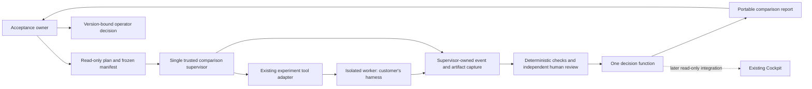
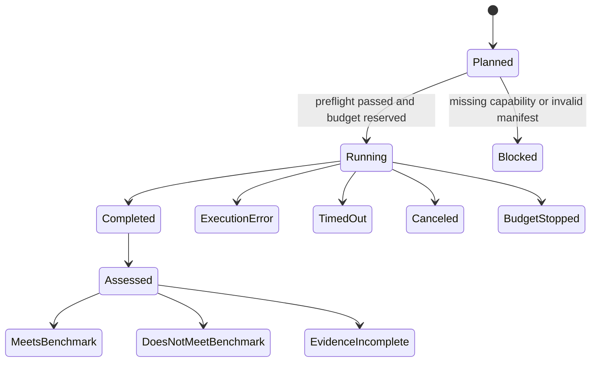

# System design: one agent acceptance workflow

Accepted architecture · 2026-09-05. This document specifies the target proof;
current implementation status is in [the build handoff](build-handoff.md). Product scope is in [product.md](product.md).
Tom authorized the architecture/scaffolding stage, followed by Extra High implementation
and High debugging. No evaluated-worker calls, deployment or dispatch occurred in
the scaffold stage.

## 1. System boundary

The product unit is a **comparison**: an approved benchmark, a baseline agent
version, a changed agent version and the evidence used to judge them. Here,
“changed version” means the proposed instruction bundle; the existing Ivy glossary's
“candidate” continues to mean a scout's work opportunity.

An **agent version** includes the visible instructions and imports, harness version,
requested and observed model settings, available tools, permissions and environment.
A **benchmark** contains cases, fixtures, criteria, grader versions and a decision
policy. These are new acceptance-domain terms, separate from dispatch contracts.

The first workflow reviews a frozen PR snapshot and produces structured findings.
It runs with no production write credentials. A successful acceptance decision means
that this review agent met this benchmark, not that the PR it reviewed should merge.

Keep the existing scheduled routines and dispatch runner operationally separate.
They are useful dogfood and sources of incidents; they are not a comparison engine.
The new proof is invoked deliberately and never added to the daily autonomous queue.

## 2. Smallest useful architecture

Use Python for the small local supervisor and normalized result handling, matching
Ivy's current scripts. Start with a pinned Promptfoo configuration and one custom
provider wrapper for existing experiment execution, if a two-hour integration spike
preserves the contract below. Keep grading and authoritative captures in the trusted
supervisor. If the tool cannot meet a specific demonstrated requirement, replace
only that boundary with a small sequential subprocess adapter and record why. Give
the existing-tool wrapper at most 30 minutes of that same two-hour spike; switching
approaches never resets the overall clock.
Do not build two engines to compare them in parallel.

Local JSON manifests, JSONL event captures and files suffice for this proof. One
process owns execution, with a process lock and unique comparison/attempt IDs.
Finalization writes a new result atomically. No database, job service or HTTP command
endpoint is needed for this scale. A report can be JSON plus generated Markdown;
the current Cockpit can consume the same result later when its source is available.

The report must work without the Cockpit. Its layout serves the release decision:
change and scope, verdict and coverage, regressions/gaps, case evidence, recorded
cost/time, then operator decision. No five-route redesign is needed to test that job.

## 3. What can be reused and what cannot

Evidence below refers to [housekeeping revision de084f1](https://github.com/tompulsarlabs/ivy/tree/de084f15bece5393630dc6cf57191043a684c379),
not an assumption about deployed main.

| Current part | Reuse | Gap for the proof |
|---|---|---|
| `evals/agents.json` and case bank | Role objectives and incident-derived requirements | Prose cases need executable fixtures; one review prompt reveals its seeded defect |
| `scripts/verification.py` | Fail-closed completeness tests and receipt concepts | Receipt identity is declared, not authenticated; assignment hash omits frontmatter; explicit quarantine does not revoke a passing receipt |
| `scripts/eval-agents.py` | Case/artifact binding and incomplete-coverage rejection | No execution, pairing, repeated trials, environment identity or comparison policy |
| `scripts/dispatch-runner.py` | Lessons from timeouts, heartbeat and CLI integration | Mutable checkout, ambient settings, retained ignored files, effort not passed through, configured model reported without runtime confirmation |
| Current evidence files | Real examples of skipped checks and weak proof | Final report and short error tail do not capture a complete execution or all effects |
| Cockpit V3.1 brief | Separation of claims, observations, verification and decisions | Brief is a separate local proposal; code was unavailable here and its execution path is described as disconnected |

Do not import the dispatch runner as an eval backend or invoke its `--dry-run` as
a harmless preview: synchronization and some failure handling can mutate state before
its dry-run branch. The comparison planner is a separate read-only code path.

The quarantine inconsistency must be resolved before any shared dispatch/Cockpit
integration. The present gate can accept a receipt while the contract says unverified.
A shared authoritative decision with explicit revocation semantics replaces that
ambiguity; this design does not silently alter the live dispatch policy.

## 4. Portable data contracts

Version every format. A comparison has these logical records; separate files are a
convenience, not a requirement for a future service.

| Record | Required fields and purpose |
|---|---|
| `benchmark.json` | Schema version, workflow ID, case IDs, task/fixture hashes, criteria and criticality, rubric/grader hashes, repetition count, acceptance policy, owner approval |
| `agent-version.json` | Ordered instruction/import manifest with content hashes, harness/version, requested model/effort, tool versions and permissions, environment/image digest, config digest and known visibility gaps |
| `comparison.json` | Benchmark hash, both agent-version hashes, selected cases, paired run order, budget and comparison ID; plan digest stored separately |
| `attempt.json` | Run/attempt ID, variant, case, repetition, start/finish, terminal execution state, effective runtime metadata, capture hashes, available usage and missing fields |
| `assessment.json` | Attempt/capture/benchmark hashes, per-criterion pass/fail/unverified, evidence references, grader identity/version and review timestamp |
| `result.json` | Immutable assessment-set hash, policy hash, computed benchmark result and coverage |
| `operator-actions.jsonl` | Append-only local decisions with actor, time, rationale and exact result/agent-version hash; never part of the hash they reference |

For the proof, canonical manifest encoding is UTF-8 JSON with sorted object keys,
compact separators, no non-finite numbers, and stable array order; hash those exact
bytes with SHA-256. Store the plan digest in a detached `comparison.sha256` file;
never include a digest inside the bytes it hashes. Approval and attempt records
reference that detached digest. Hash fixture file bytes separately, including paths, executable
bits and relevant symlink targets. Reject duplicate normalized paths, escaping paths,
unresolved imports and mutable external fixture references. Freeze a file manifest
of the actual inputs, not just a branch name or Markdown task body.

Agent manifests contain configuration, never secret values. Credential identity is
represented by an opaque credential reference when needed; credentials themselves
stay in the executing environment. Hidden provider instructions and undisclosed
backend changes cannot be hashed: record them as opaque limitations rather than
claiming total model reproducibility.

Worker input is the neutral task, visible fixture and intended instruction bundle.
Do not mount answer keys, seeded-defect descriptions, hidden checks, other outputs,
operator decisions or expected scores. The current review case that names its
negative-quantity defect must be rewritten before it measures detection ability.

## 5. Harness adapter and preflight

Support one installed coding harness first. The adapter contract has four operations:

- `describe`: expose supported settings, event types, isolation requirements and
  provenance fields; unsupported requested settings fail preflight.
- `prepare`: construct a fresh fixture workspace and explicit configuration from
  the frozen plan, with no inherited user skills, hooks or unknown project imports.
- `run`: accept a neutral task and visible fixture, stream events to supervisor-owned
  capture, and return terminal execution metadata. No execution through a shell string.
- `cancel`: terminate the attempt-owned container, confirm it is stopped, then
  finalize partial capture and stop any launcher process group. Killing a CLI client
  alone does not establish that its workload stopped. Unconfirmed termination keeps
  capacity reserved and blocks further launches; provider work already in flight may
  outlast local cancellation.

The adapter must report **requested** versus **observed** model/effort separately.
Never infer observed values from the command line. When a required runtime field
cannot be confirmed, the result is evidence-incomplete for the corresponding
comparison claim. Do not switch models silently to get a run to pass preflight.
Provider nondeterminism remains even with complete visible metadata.

Freeze the provenance requirements before any trial. The proof's claim is a
comparison of two instruction bundles under the same captured visible configuration,
not proof of an identical hidden provider backend:

| Field | Acceptable source | If unavailable |
|---|---|---|
| Harness executable/version, image, fixture and visible instruction files | Supervisor measurements and content digests | Block preflight |
| Effective tool/permission config and requested model/effort | Exact generated config/argv plus adapter validation; never worker prose | Block preflight if unsupported or unresolved |
| Observed model/effort or resolved model snapshot | Provider/harness execution metadata when exposed | Mark unavailable; do not claim identical resolved model execution |
| Actual completion, output and relevant tool/effect events | Supervisor-owned stream and declared monitors | Affected checks unverified; no complete benchmark result |
| Tokens, requests and billed dollars | Harness/provider usage records, with origin and units | Show unavailable; no savings claim for that metric |

A same-requested-configuration comparison remains reportable when the provider does
not expose its resolved backend, with that limitation beside the result. A benchmark
that requires a pinned resolved model must declare it beforehand and cannot relax the
requirement after execution. If observed model/effort differs between variants,
retain their standalone benchmark observations but mark the pair non-comparable for
an instruction-only conclusion. The proof must capture the requested model and disclose
observed provenance; it must not repeat the earlier unqualified model attribution.

Codex's documented noninteractive interface supports JSONL events and a structured
final output schema, so it is a plausible first adapter. That does not guarantee
that every required setting is exposed by Tom's installed version; the spike must
verify it. [Official noninteractive documentation](https://learn.chatgpt.com/docs/non-interactive-mode)

Customer control means an adapter invokes the chosen harness with an explicit
version/configuration. A customer's external harness can later implement the same
contract. It does not mean that arbitrary harnesses are already supported. Importing
old externally produced results is a separate mode with declared evidence limitations,
not a substitute for proving live execution.

## 6. Trust and evidence boundary

The trusted party is the local operator and supervisor. The worker's outputs,
repository documents and external text are untrusted. For the proof, execute the
worker in a disposable local Docker container with only its visible
fixture, explicit harness configuration and a scratch/output area. Keep grader
fixtures, decision files and authoritative captures outside that filesystem namespace.
Do not mount a host home directory, GitHub credentials or container-control socket.
Pin the environment. The first R6 case tests an attempted write to one protected
fixture path through a harness tool, observed in the structured event stream plus
filesystem checks; it does not claim complete syscall/network-attempt auditing. Use
synthetic or explicitly cleared code and no production write credentials. Grader
files are not mounted, so there is no path for the worker to inspect them. A
customer-data pilot requires an explicit egress/data policy and its enforcement.

The read-only availability check in this design found no callable `docker`, `podman`
or `colima` on this Mac's PATH. First establish one Docker-compatible runtime and
the chosen harness authentication within the spike limit. No runtime was installed
or credentials moved here. Do not add a remote-CI alternative simultaneously; if
this prerequisite cannot be met within the budget, stop with that blocker.

A separate worktree or a different model is not an access boundary. If the installed
harness cannot operate in the required isolation within the spike budget, stop with
that concrete blocker. A supervised local run may aid diagnosis but cannot satisfy
the enforcement acceptance test or be advertised as isolated execution.

The supervisor captures the raw event stream, tool observations exposed by the
adapter, exit state, relevant before/after filesystem manifests and output artifacts.
A worker-supplied success flag is never observation evidence. Event completeness and
monitor scope are declared. Absence of a logged write is not proof of no write when
the adapter did not observe that class of action. Denied attempts are distinguished
from successful side effects; a criterion about obeying authorization can fail on an
attempt even when the environment prevented the effect.

Only the trusted supervisor seals the capture index. Graders reference hashes and
locations within that index, not arbitrary files whose existence is accepted as
proof. The human reviewer records its own assessment after execution. A model grader,
if later added, sees artifacts as quoted data without authority to call tools or
change policy; it needs calibration against labeled human judgments before gating.
OpenAI likewise recommends validating model-judge agreement with human labels.
[Evaluation guidance](https://developers.openai.com/api/docs/guides/evaluation-best-practices)

Hashes detect modification relative to a trusted recorded value. They do not make
local files an immutable audit log or protect against a compromised host. Customer
pilots need the same access separation and explicit data handling; multi-user service
identity, scoped credentials, authenticated submissions, retention policy and
reviewer authorization belong to a later customer-driven deployment decision.

## 7. Execution, assessment and operator state

Keep three state machines separate:

Partial captures from other terminal execution states remain assessable for known
failures, but cannot satisfy a required complete run. A timed-out attempt might
reveal a prohibited action; record that failure as well as the timeout.

One deterministic decision function is authoritative for reports, CLI exit status
and any later UI. Known required-criterion failures produce **Does not meet this
benchmark**, even when other evidence is missing. With no known failure, any missing,
invalid, revoked or ungraded required evidence yields **Evidence incomplete**. Only
all required criteria on every planned repetition passing yields **Meets this
benchmark**. Show case/repetition coverage and the failure/gap counts alongside it.
A weighted average can never conceal a critical failure.

Aggregate each variant separately. A missing baseline prevents comparative claims
even if the changed version has a complete standalone result. Freeze 24 primary trial slots keyed by variant, case and repetition. Pair their
results by case, fixture, rubric and repetition; randomize which variant runs first using a recorded
schedule. Preserve every planned attempt, including failures. Retries receive new attempt IDs linked to the original slot and consume the same
global budget. For this proof they are diagnostic only: they neither repair primary
coverage nor replace an adverse primary result. A new primary comparison requires
a new frozen plan and budget.

Every primary slot launches a fresh harness execution. Disable experiment-tool
result caching and resume reuse; an old execution cannot fill a new repetition.
Provider prompt caching is different: it may remain, with its usage recorded.

The first proof has no automatic promotion. Its report shows per-case changes and
observed time/usage. Small samples are smoke/regression evidence, not a statistical
reliability estimate. Fewer instructions or fewer tokens do not establish better
quality; both variants may pass, both may fail, or the result may be inconclusive.

An operator action is appended against the exact immutable result hash: release,
hold or request evidence. “Release” records a local decision; it does not deploy
anything. The proof preserves the observation result and version-bound operator
record without implementing operational release eligibility or revocation enforcement.
A new instruction, fixture or rubric version requires a new comparison. Benchmark
edits are reviewed separately from the agent change they will judge.

Before later dispatch/Cockpit/release integration, introduce a derived current
eligibility view: a hold blocks release without rewriting a benchmark pass; only a
new authorized operator action can supersede that hold. An invalidated evidence item
requires a new valid assessment, which cannot by itself release an operator hold.
Keep evidence invalidation and operator holds distinct. Never let a stale receipt
or a browser's locally recomputed policy undo either. This later behavior is a
prerequisite for connecting a release mechanism, not a feature of the first report.

## 8. Resource and failure control

The supervisor reserves a worker-attempt slot and worst-case allowed time before each launch.
Start serially; no supervisor retries, model fallbacks or hidden judge calls. A worker
attempt may contain several provider requests; capture that usage when available
and do not describe the attempt cap as an API-request or token ceiling. Cap total
attempts, per-attempt elapsed time, total elapsed time and captured output size.
On interruption, finalize an incomplete attempt; restarting requires an explicit new
attempt, and duplicate IDs cannot overwrite an existing capture.

For APIs, a configured dollar ceiling is valid only where the adapter can enforce
request/token limits and use a dated price table or provider budget boundary. Missing
billing visibility is not zero cost. Subscription CLIs use explicit call/time limits;
show tokens when available and billed dollars as unavailable, not an invented API
price. Include grader and setup calls in the budget. No paid run starts in this design.

| Failure | Required behavior |
|---|---|
| Provider/model/tool unavailable | Preflight blocked where possible; otherwise execution error, no silent fallback |
| Worker timeout/crash/cancel | Preserve bounded partial capture, terminal reason and missing coverage |
| Capture truncation or missing events | Mark affected criteria unverified; do not reconstruct them from final prose |
| Manifest, fixture or artifact modified | Reject stale assessment binding; retain prior history |
| Operator records hold in the proof | Retain benchmark observations and record the exact version held; no release command exists |
| Budget exhausted | Stop launching attempts, show planned versus completed coverage |
| Same comparison started twice | Local lock and unique ID prevent concurrent ownership; distributed claims are out of scope |
| Report exported with sensitive content | Explicit export selection; private by default; no automatic push of pilot evidence to Ivy's public repository |

## 9. Growth only after the proof

A second functioning adapter tests portability. A first external pilot tests fixture
cost and value. Repeated pilot demand for shared approvals can justify a small service
with customer-owned runners, authenticated result submission and private artifact
storage. Background execution would then need leases, idempotent commands, cancellation
acknowledgments and scoped service identities. Those needs are not reasons to build
a distributed scheduler in the local proof.

The acceptance module's interface is a frozen plan in, evidence and decision out.
It may eventually sit behind the existing Cockpit or integrate with an existing
customer evaluation tool. Keep daily Ivy policy and the website's append-only
`state.json` contract untouched while that value is tested.
